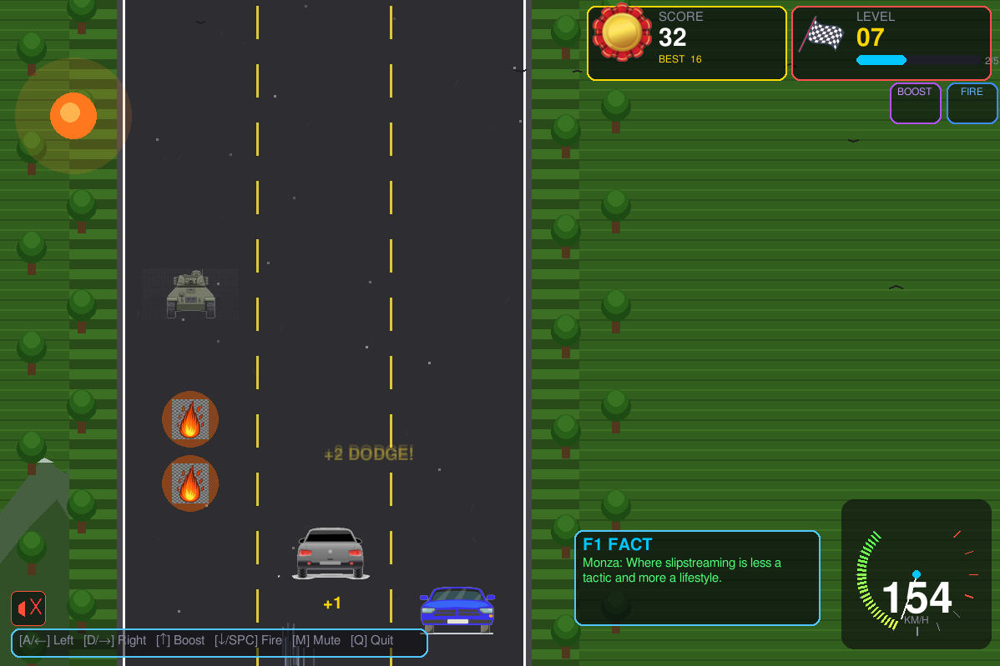

# Car Dodge

A fast-paced arcade-style car dodging game built with Pygame. Dodge oncoming cars for as long as you can while collecting power-ups and achieving high scores!

## 🎮 Gameplay

- **Objective**: Navigate your car through traffic and avoid collisions for as long as possible
- **Controls**: Use arrow keys to switch between lanes
- **Difficulty**: Speed increases progressively as you survive longer
- **Power-ups**: Collect fire power and booster power-ups that appear randomly every 40 points
- **Strategy**: Choose wisely - you can only hold one power-up at a time!

## 🚀 Features

### Core Gameplay
- 3-lane highway with dynamic traffic
- Progressive difficulty system
- Smooth lane-switching mechanics
- Collision detection and scoring system

### Customization
- **6 Player Car Skins**: Blue, Red, Green, Orange, Purple, White
- **5 Sound Themes**: 
  - Engine (realistic engine sounds)
  - Retro (arcade beeps & booms)
  - Minimal (whoosh & screech)
  - Race (race track music)
  - Silent (no sound)
- **Game Modes**: Standard and Curvy mode for enhanced control

### Power-ups
- **Fire Power**: Unleashes destructive capabilities
- **Booster Power**: Provides speed enhancements
- Power-ups appear for 2 seconds - grab them quickly!
- Only one power-up can be held at a time

### Visual Features
- Modern HUD with real-time score display
- Animated backgrounds and road effects
- Multiple enemy vehicle types including tankers and bombs
- Visual feedback for power-ups and collisions

### Audio System
- Dynamic sound effects for crashes, lane switches, and power-ups
- Background music support
- Theme-based audio customization

## 🏆 Scoring System

- Points accumulated based on survival time and enemies passed
- High scores saved to SQLite database
- Top 5 scores leaderboard
- Best score tracking across sessions

## 🛠️ Technical Details

### Requirements
- Python 3.7+
- Pygame library
- SQLite3 (included with Python)

### Installation
```bash
# Clone the repository
git clone <repository-url>
cd cargame

# Install pygame
pip install pygame

# Run the game
python main.py
```

### Project Structure
```
cargame/
├── main.py              # Game entry point
├── cargame/             # Core game modules
│   ├── constants.py     # Game constants and configuration
│   ├── game.py          # Main game loop and logic
│   ├── enemy.py         # Enemy vehicle management
│   ├── renderer.py      # Graphics rendering
│   ├── hud.py           # Heads-up display
│   ├── screens.py       # Menu and splash screens
│   ├── sound.py         # Audio system
│   ├── scores.py        # Score database management
│   ├── cars.py          # Player car rendering
│   └── factory.py       # Object factory patterns
├── assets/              # Game assets
│   ├── vehicles/        # Enemy vehicle sprites
│   ├── sounds/          # Audio files
│   ├── facts/           # Game facts and tips
│   └── *.png           # UI elements and power-ups
└── scores.db           # SQLite database for high scores
```

## 🎯 Game Controls

| Key | Action |
|-----|--------|
| ← → | Switch lanes |
| ESC | Pause/Menu |
| Space | Confirm selections |

## 📊 Game Configuration

### Display Settings
- Resolution: 1200x800 pixels
- FPS: 60
- 3-lane highway layout

### Difficulty Progression
- Base speed: 3.0 pixels/frame
- Speed increment: 0.8 pixels/frame per level
- Invincibility duration: 3 seconds after power-up

## 🔧 Development Notes

- Built with Pygame for cross-platform compatibility
- Modular architecture for easy maintenance
- Asset preloading to prevent first-game lag
- SQLite integration for persistent scoring
- Event-driven game loop design

## 🐛 Known Issues & TODO

From development notes (`assets/work.md`):
- Score database integration needs verification
- Best score display in score card
- Power-up placement logic refinement

## 📄 License

[Add your license information here]

## 🤝 Contributing

[Add contribution guidelines here]

---


**Enjoy the ride! Remember: The road always wins.** 🏁
